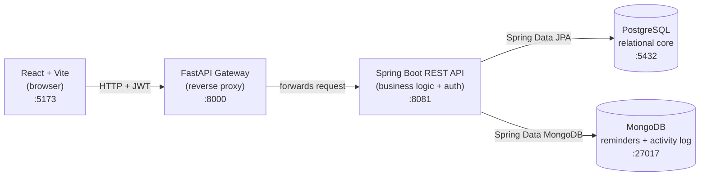
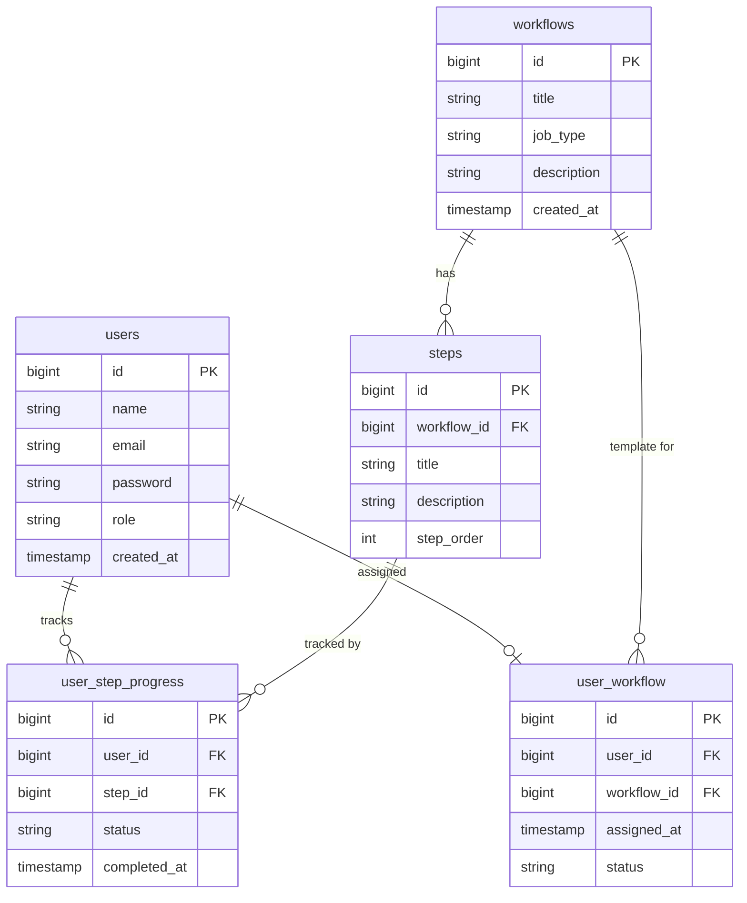
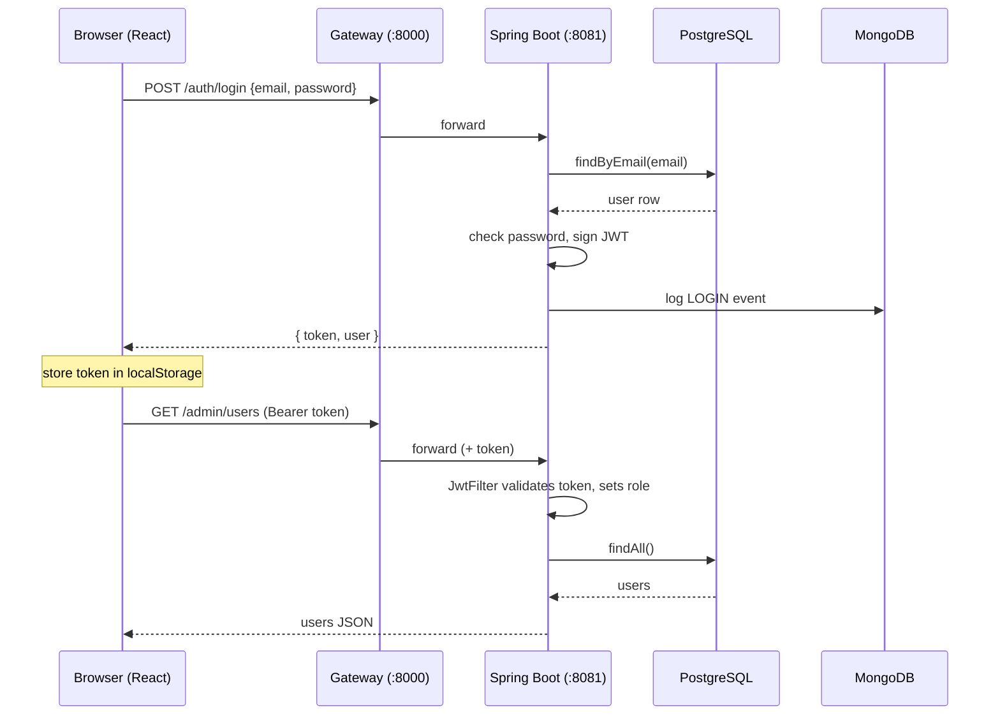

# Employee Onboarding Management System

A full-stack web application that manages the onboarding of new employees. An **admin** builds reusable onboarding *workflows* (an ordered list of steps), assigns them to new hires, a **manager** monitors everyone's progress and nudges them with reminders, and each **user** (new hire) works through their assigned steps and marks them done.

This is a **DBMS course project** that deliberately demonstrates **polyglot persistence** — it uses a **relational database (PostgreSQL)** for the structured core data and a **document database (MongoDB)** for append-only, document-shaped data, each chosen for what it does best.

---

## Table of Contents

1. [Architecture](#architecture)
2. [Technology Stack](#technology-stack)
3. [The Three Roles](#the-three-roles)
4. [Repository Layout](#repository-layout)
5. [Backend — Files & Classes](#backend--files--classes)
6. [Gateway — Files](#gateway--files)
7. [Frontend — Files & Components](#frontend--files--components)
8. [Database Design](#database-design)
9. [Authentication & Security](#authentication--security)
10. [REST API Reference](#rest-api-reference)
11. [End-to-End Data Flow](#end-to-end-data-flow)
12. [Setup & Running Locally](#setup--running-locally)
13. [Default Credentials](#default-credentials)

---

## Architecture

The system is built as **four tiers**. The React app never talks to Spring Boot directly — it goes through a thin **FastAPI gateway** that reverse-proxies every request. Spring Boot then reads/writes to **two databases**.



**Why a gateway?** It gives the frontend a single origin (`:8000`), centralises CORS handling, and mimics a real-world API-gateway pattern. It is intentionally "dumb" — it just copies the method, headers (including the `Authorization` JWT), body, and query params straight through to Spring Boot.

**Why two databases (polyglot persistence)?**

| Data | Database | Reason |
|------|----------|--------|
| users, workflows, steps, assignments, step-progress | **PostgreSQL** | Strongly relational — real foreign keys, joins, and integrity constraints. |
| reminders, activity log | **MongoDB** | Append-only, self-contained documents. No joins needed; schema-flexible. |

---

## Technology Stack

| Layer | Technology |
|-------|------------|
| Frontend | React 18, React Router 6, Vite 5, Axios, plain CSS (CSS variables, light theme) |
| Gateway | Python 3, FastAPI, Uvicorn, httpx |
| Backend | Java 17 (built/run on JDK 21), Spring Boot 3.2, Spring Web, Spring Security, Spring Data JPA, Spring Data MongoDB, **JJWT** (JWT library), springdoc-openapi (Swagger UI) |
| Relational DB | PostgreSQL |
| Document DB | MongoDB |
| Build tools | Maven (`mvnw` wrapper) for backend, npm for frontend, pip for gateway |

---

## The Three Roles

| Role | Dashboard route | Capabilities |
|------|-----------------|--------------|
| **ADMIN** | `/admin` | Create users, create workflows and their steps, assign a workflow to a user, view the activity log. |
| **MANAGER** | `/manager` | View every employee's onboarding progress, send reminders, view reminders sent to a user. |
| **USER** (new hire) | `/dashboard` | View their assigned workflow + steps, mark steps as done. |

Roles are stored on the `users` row and embedded into the JWT. Spring Security enforces them per URL prefix (`/admin/**`, `/manager/**`, `/user/**`).

---

## Repository Layout

```
unboarding-project/
├── onboarding-backend/     # Spring Boot REST API (Java)
├── onboarding-gateway/     # FastAPI reverse proxy (Python)
├── onboarding-frontend/    # React single-page app (JavaScript)
├── .gitignore
└── README.md               # this file
```

---

## Backend — Files & Classes

Root package: `com.onboarding.backend`. Built with Maven (`pom.xml`).

```
onboarding-backend/
├── pom.xml                                   # Maven build + dependencies
├── mvnw / mvnw.cmd                           # Maven wrapper (no global Maven needed)
└── src/main/
    ├── java/com/onboarding/backend/
    │   ├── BackendApplication.java           # @SpringBootApplication entry point
    │   ├── config/
    │   │   ├── JwtUtil.java                   # create & parse/validate JWTs
    │   │   ├── JwtFilter.java                 # per-request auth filter
    │   │   └── SecurityConfig.java            # security rules, route authority, CORS
    │   ├── controller/
    │   │   ├── AuthController.java            # POST /auth/login
    │   │   ├── AdminController.java           # /admin/** endpoints
    │   │   ├── ManagerController.java         # /manager/** endpoints
    │   │   └── UserController.java            # /user/** endpoints
    │   ├── model/                             # JPA @Entity classes → PostgreSQL
    │   │   ├── User.java
    │   │   ├── Workflow.java
    │   │   ├── Step.java
    │   │   ├── UserWorkflow.java
    │   │   └── UserStepProgress.java
    │   ├── document/                          # Mongo @Document classes → MongoDB
    │   │   ├── Reminder.java
    │   │   └── ActivityLog.java
    │   ├── repository/
    │   │   ├── UserRepository.java            # JPA
    │   │   ├── WorkflowRepository.java        # JPA
    │   │   ├── StepRepository.java            # JPA
    │   │   ├── UserWorkflowRepository.java    # JPA
    │   │   ├── UserStepProgressRepository.java# JPA
    │   │   ├── ReminderRepository.java        # MongoRepository
    │   │   └── ActivityLogRepository.java     # MongoRepository
    │   └── service/
    │       └── ActivityLogService.java        # writes audit events to MongoDB
    └── resources/
        └── application.properties             # DB connections, JPA, server port
```

### Configuration classes (`config/`)

- **`BackendApplication`** — standard Spring Boot bootstrap (`SpringApplication.run`). Because both Spring Data JPA and Spring Data MongoDB are on the classpath, Spring auto-detects repositories by their base interface: `JpaRepository` → PostgreSQL, `MongoRepository` → MongoDB. No manual configuration needed.

- **`JwtUtil`** — wraps the **JJWT** library.
  - `generateToken(email, role)` — builds an **HS256**-signed token with the email as the subject, a `role` claim, an issued-at, and a **24-hour expiry**.
  - `getEmail(token)` / `getRole(token)` — read claims back out.
  - `isValid(token)` — returns `true` if the signature parses and the token isn't expired.
  - The signing secret is a hard-coded 32-char string (fine for a course demo; should be externalised in production).

- **`JwtFilter`** — a `OncePerRequestFilter` that runs on every request. It reads the `Authorization: Bearer <token>` header, validates the token via `JwtUtil`, and if valid, places a `UsernamePasswordAuthenticationToken` (carrying the email and a single role authority) into the `SecurityContextHolder`. Controllers then read the logged-in user via `SecurityContextHolder.getContext().getAuthentication().getName()` (which returns the email).

- **`SecurityConfig`** — defines the `SecurityFilterChain`:
  - Disables CSRF, HTTP Basic, and form login; sets the session policy to **STATELESS** (no server sessions — auth is purely via JWT).
  - Authorises routes by authority: `/auth/**` and Swagger are public; `/admin/**` requires `ADMIN`; `/manager/**` requires `MANAGER`; `/user/**` requires `USER`.
  - Registers `JwtFilter` before the username/password filter.
  - Configures permissive **CORS** so the gateway/browser can call it.

### Controllers (`controller/`)

- **`AuthController`** — `POST /auth/login`. Looks the user up by email, compares the password (plain-text comparison — demo only), issues a JWT, logs a `LOGIN` activity event to MongoDB, and returns `{ token, user }`.

- **`AdminController`** — user management, workflow/step authoring, assignment, and the activity-log read endpoint. The **`/admin/assign`** endpoint is the key one: it creates a `UserWorkflow` row and then creates one `UserStepProgress` row (status `PENDING`) for every step in the workflow, then logs a `WORKFLOW_ASSIGNED` event.

- **`ManagerController`** — `GET /manager/users` aggregates each employee's progress (total steps vs. completed steps, workflow title and status). `POST /manager/reminders` writes a `Reminder` **document to MongoDB** and logs a `REMINDER_SENT` event.

- **`UserController`** — `GET /user/my-workflow` returns the user's workflow, its steps, and their per-step progress. `PATCH /user/steps/{stepId}/complete` marks a step `DONE`, stamps `completed_at`, logs a `STEP_COMPLETED` event, and — if all of the user's steps are now `DONE` — flips the `UserWorkflow` status to `COMPLETED`.

### Persistence model

- **JPA entities (`model/`)** map to PostgreSQL tables via `@Entity` / `@Table`. IDs are auto-generated (`IDENTITY`). `@PrePersist` hooks set timestamps and default statuses.
- **Mongo documents (`document/`)** map to MongoDB collections via `@Document`. IDs are `String` (Mongo `ObjectId`).
- **Repositories (`repository/`)** are Spring Data interfaces. JPA ones extend `JpaRepository<T, Long>`; Mongo ones extend `MongoRepository<T, String>`. Custom finder methods (e.g. `findByEmail`, `findByWorkflowId`, `findByUserIdAndStepId`, `findAllByOrderByTimestampDesc`) are derived automatically from their method names.
- **`ActivityLogService`** is a thin helper so any controller can record an audit event in one line: `activityLogService.log(action, actorEmail, detail)`.

---

## Gateway — Files

```
onboarding-gateway/
├── main.py            # FastAPI reverse proxy
└── requirements.txt   # fastapi, uvicorn, httpx
```

**`main.py`** exposes a single catch-all route that accepts any method on any path. It:
1. Short-circuits CORS `OPTIONS` preflight requests with a `200`.
2. Forwards everything else to `http://localhost:8081/<path>` using **httpx**, copying the method, headers (including the JWT), raw body, and query params.
3. Returns Spring Boot's response (content, status code, content-type) back to the browser.

It runs on **port 8000**, which is the `baseURL` the frontend's Axios client targets.

---

## Frontend — Files & Components

```
onboarding-frontend/
├── index.html              # Vite HTML entry, mounts #root
├── vite.config.js          # Vite + React plugin
├── package.json            # deps: react, react-dom, react-router-dom, axios
└── src/
    ├── main.jsx            # ReactDOM.createRoot → renders <App/>
    ├── App.jsx             # routing, route guards, role-based redirect
    ├── index.css           # all styling (light theme via CSS variables)
    ├── api/
    │   └── axios.js        # Axios instance + JWT request interceptor
    ├── context/
    │   └── AuthContext.jsx # global auth state (user + login/logout)
    └── pages/
        ├── Login.jsx           # login form
        ├── AdminDashboard.jsx  # users, workflows, steps, assignment
        ├── ManagerDashboard.jsx# progress table + reminders
        └── UserDashboard.jsx   # the new hire's step checklist
```

- **`main.jsx`** — mounts `<App/>` into `#root` inside `React.StrictMode`.

- **`App.jsx`** — wraps everything in `<AuthProvider>` and `<BrowserRouter>` and declares the routes. Two helper components:
  - **`PrivateRoute`** — redirects to `/login` if there's no logged-in user, or if the user's role doesn't match the route's required role.
  - **`RoleRedirect`** — on hitting `/`, sends the user to the right dashboard based on their role.

- **`AuthContext.jsx`** — a React context holding the current `user`. `login()` saves the token + user to `localStorage` and updates state; `logout()` clears them. The user is rehydrated from `localStorage` on page load, so refreshes keep you logged in.

- **`api/axios.js`** — a pre-configured Axios instance with `baseURL: http://localhost:8000` (the gateway). A **request interceptor** automatically attaches `Authorization: Bearer <token>` (read from `localStorage`) to every outgoing request.

- **`pages/`** — one component per dashboard. `Login.jsx` posts to `/auth/login` and routes by role. The dashboards call the role-specific endpoints (e.g. admin creates workflows and assigns them; manager views `/manager/users` and posts reminders; user views `/user/my-workflow` and PATCHes step completion).

- **`index.css`** — the entire visual theme is driven by CSS custom properties in `:root` (a **light theme**: off-white background, white cards with soft shadows, dark text, emerald accent). It defines the sidebar layout, cards, forms, buttons, tables, badges, step lists, progress bars, stat cards, alerts, and the login screen.

---

## Database Design

### PostgreSQL — relational core



- **`users`** — every account (admin, manager, or new hire). `role` ∈ `{ADMIN, MANAGER, USER}`.
- **`workflows`** — a reusable onboarding template.
- **`steps`** — the ordered tasks belonging to a workflow (`step_order`).
- **`user_workflow`** — assigns exactly one workflow to a user. `status` ∈ `{IN_PROGRESS, COMPLETED}`. (The assign endpoint rejects a second workflow for the same user.)
- **`user_step_progress`** — one row per (user, step), tracking that user's status on that step. `status` ∈ `{PENDING, DONE}`.

> Note: the schema is created manually in PostgreSQL (`spring.jpa.hibernate.ddl-auto=none`, so Hibernate does **not** auto-create tables). An old `reminders` table may still exist in PostgreSQL but is no longer used — reminders now live in MongoDB.

### MongoDB — document collections

**`reminders`** — a manager's nudge to a user:
```json
{
  "_id": "ObjectId",
  "managerId": 3,
  "userId": 2,
  "message": "Please finish your IT setup step.",
  "sentAt": "2026-06-15T10:00:00"
}
```

**`activity_log`** — an append-only audit trail; one document per system event:
```json
{
  "_id": "ObjectId",
  "action": "STEP_COMPLETED",
  "actorEmail": "yashwanth@company.com",
  "detail": "Yashwanth completed step 4",
  "timestamp": "2026-06-15T10:05:00"
}
```
`action` ∈ `{LOGIN, STEP_COMPLETED, WORKFLOW_ASSIGNED, REMINDER_SENT}`. Both collections are created automatically on first write — no schema migration required, which is exactly the NoSQL strength being demonstrated.

---

## Authentication & Security

1. The user submits email + password to `POST /auth/login`.
2. The backend verifies the credentials and returns a **JWT** (HS256, 24-hour expiry) containing the email (subject) and role (claim).
3. The frontend stores the token in `localStorage`; the Axios interceptor attaches it as `Authorization: Bearer <token>` on every request.
4. On the backend, `JwtFilter` validates the token on each request and populates the Spring Security context with the user's role.
5. `SecurityConfig` authorises the request by URL prefix against that role (stateless — no sessions).



> Security caveats (acceptable for a course demo, not production): passwords are stored and compared in **plain text**, the JWT secret is hard-coded, and CORS allows all origins.

---

## REST API Reference

All paths are reached through the gateway at `http://localhost:8000` (which forwards to Spring Boot at `:8081`).

### Auth — `/auth` (public)
| Method | Path | Body | Description |
|--------|------|------|-------------|
| POST | `/auth/login` | `{ email, password }` | Returns `{ token, user }`. Logs a `LOGIN` event. |

### Admin — `/admin` (role `ADMIN`)
| Method | Path | Body | Description |
|--------|------|------|-------------|
| GET | `/admin/users` | — | List all users. |
| POST | `/admin/users` | `{ name, email, password, role }` | Create a user (rejects duplicate email). |
| GET | `/admin/workflows` | — | List all workflows. |
| POST | `/admin/workflows` | `{ title, job_type, description }` | Create a workflow. |
| GET | `/admin/workflows/{id}/steps` | — | List a workflow's steps. |
| POST | `/admin/workflows/{id}/steps` | `{ title, description, step_order }` | Add a step to a workflow. |
| POST | `/admin/assign` | `{ user_id, workflow_id }` | Assign a workflow; auto-creates a `PENDING` progress row per step. Logs `WORKFLOW_ASSIGNED`. |
| GET | `/admin/activity` | — | The MongoDB audit trail, newest first. |

### Manager — `/manager` (role `MANAGER`)
| Method | Path | Body | Description |
|--------|------|------|-------------|
| GET | `/manager/users` | — | All `USER` employees with progress (title, status, total/done steps). |
| POST | `/manager/reminders` | `{ user_id, message }` | Send a reminder (stored in MongoDB). Logs `REMINDER_SENT`. |
| GET | `/manager/reminders/{userId}` | — | Reminders sent to one user (from MongoDB). |

### User — `/user` (role `USER`)
| Method | Path | Body | Description |
|--------|------|------|-------------|
| GET | `/user/my-workflow` | — | The logged-in user's workflow + steps + progress. |
| PATCH | `/user/steps/{stepId}/complete` | — | Mark a step `DONE`; logs `STEP_COMPLETED`; completes the workflow if all steps are done. |

Interactive API docs (Swagger UI) are available directly on the backend at `http://localhost:8081/swagger-ui/index.html`.

---

## End-to-End Data Flow

A typical onboarding lifecycle:

1. **Admin** creates a **workflow** and adds ordered **steps** (PostgreSQL: `workflows`, `steps`).
2. **Admin** **assigns** the workflow to a new hire → a `user_workflow` row (`IN_PROGRESS`) plus one `user_step_progress` row per step (`PENDING`). An `activity_log` document is written to MongoDB.
3. **User** logs in, sees their checklist (`GET /user/my-workflow`), and marks steps **DONE** one by one. Each completion stamps `completed_at` and logs to MongoDB. When the last step is done, the `user_workflow` status becomes `COMPLETED`.
4. **Manager** watches the progress table (`GET /manager/users`, showing *X of Y steps done*) and sends **reminders** (stored in MongoDB) to anyone lagging.
5. **Admin** can review the full **activity log** (`GET /admin/activity`) — every login, completion, assignment, and reminder across the system.

---

## Setup & Running Locally

### Prerequisites
- **JDK 21** (Spring Boot 3.2 supports 17–21; the project targets Java 17 bytecode)
- **Node.js** 18+ and npm
- **Python** 3.9+ with pip
- **PostgreSQL** running on `localhost:5432` with a database `onboarding_db` and the schema/tables created
- **MongoDB** running on `localhost:27017` (the database and collections are created automatically)

Connection settings live in `onboarding-backend/src/main/resources/application.properties`.

### 1. Backend — Spring Boot (port 8081)
```powershell
cd onboarding-backend
$env:JAVA_HOME = "C:\Program Files\Java\jdk-21"
.\mvnw.cmd spring-boot:run
```
Wait for `Started BackendApplication`.

### 2. Gateway — FastAPI (port 8000)
```powershell
cd onboarding-gateway
pip install -r requirements.txt   # first time only
python -m uvicorn main:app --port 8000
```

### 3. Frontend — React/Vite (port 5173)
```powershell
cd onboarding-frontend
npm install                        # first time only (node_modules is git-ignored)
npm run dev
```

Then open **http://localhost:5173**.

> **Start order:** Backend → Gateway → Frontend (the gateway proxies to the backend; the frontend calls the gateway).

> **MongoDB connection:** the default is `mongodb://localhost:27017/onboarding_db`. To use MongoDB Atlas instead, override it without editing the file: set the environment variable `SPRING_DATA_MONGODB_URI` to your Atlas connection string before launching the backend (keeps credentials out of git).

---

## Default Credentials

| Role | Email | Password |
|------|-------|----------|
| ADMIN | `admin@company.com` | `admin123` |
| USER | `yashwanth@company.com` | `yashwanth123` |

(There is no seeded MANAGER account — create one from the admin dashboard with role `MANAGER` to explore the manager view.)
