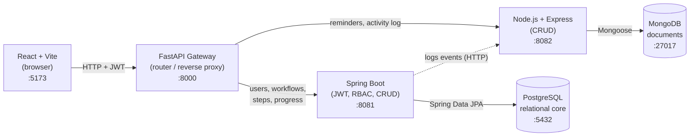
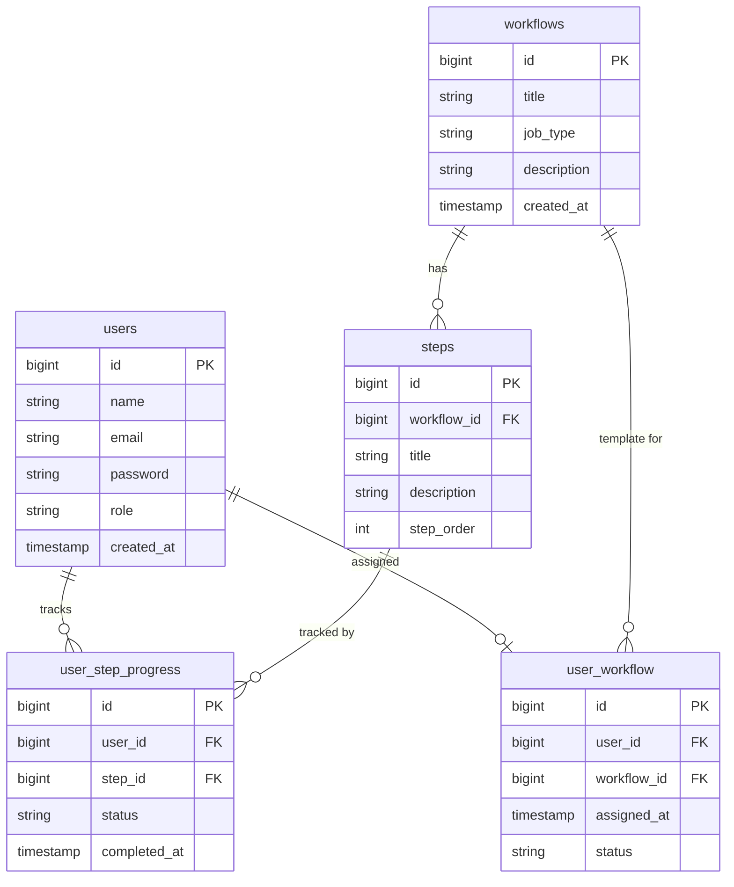

# Employee Onboarding Management System

A full-stack web application that manages the onboarding of new employees. An **admin** builds reusable onboarding *workflows* (an ordered list of steps), assigns them to new hires, a **manager** monitors everyone's progress and sends reminders, and each **user** (new hire) works through their assigned steps and marks them done.

This is a **DBMS course project** that demonstrates a **polyglot microservice architecture**: a FastAPI gateway routes requests to **two independent backends** — a **Spring Boot** service over **PostgreSQL** for the structured relational core, and a **Node.js** service over **MongoDB** for append-only document data — each chosen for what it does best.

---

## Table of Contents

1. [Architecture](#architecture)
2. [Technology Stack](#technology-stack)
3. [The Three Roles](#the-three-roles)
4. [Repository Layout](#repository-layout)
5. [Spring Boot Backend — Files & Classes](#spring-boot-backend--files--classes)
6. [Node.js Backend — Files](#nodejs-backend--files)
7. [Gateway — Files](#gateway--files)
8. [Frontend — Files & Components](#frontend--files--components)
9. [Database Design](#database-design)
10. [Authentication & Security](#authentication--security)
11. [REST API Reference](#rest-api-reference)
12. [End-to-End Data Flow](#end-to-end-data-flow)
13. [Setup & Running Locally](#setup--running-locally)
14. [Default Credentials](#default-credentials)

---

## Architecture

The system has **five tiers**. The React app talks only to a thin **FastAPI gateway**, which routes each request to one of **two backends** based on the URL — Spring Boot (PostgreSQL) or Node.js (MongoDB).



**Gateway routing:** paths whose first segment is `reminders` or `activity` go to **Node**; everything else goes to **Spring Boot**.

**Why two backends + two databases (polyglot persistence)?**

| Data | Service / DB | Reason |
|------|--------------|--------|
| users, workflows, steps, assignments, step-progress | **Spring Boot + PostgreSQL** | Strongly relational — real foreign keys, joins, integrity. |
| reminders, activity log | **Node.js + MongoDB** | Append-only, self-contained documents; no joins; schema-flexible. |

**Cross-service link:** events that happen inside Spring Boot (login, step completion, assignment, deletions) are recorded in the audit trail by **calling the Node service over HTTP** (`POST /activity`, secured by a shared internal key). This keeps all MongoDB access inside the Node service while still capturing Spring-side events. The call is best-effort — if Node is down, the main operation still succeeds.

---

## Technology Stack

| Layer | Technology |
|-------|------------|
| Frontend | React 18, React Router 6, Vite 5, Axios, plain CSS (CSS variables, light theme) |
| Gateway | Python 3, FastAPI, Uvicorn, httpx |
| Spring Boot backend | Java 17 (built/run on JDK 21), Spring Boot 3.2, Spring Web, Spring Security, Spring Data JPA, **JJWT**, springdoc-openapi (Swagger UI) |
| Node.js backend | Node 18+, Express 4, Mongoose 8, jsonwebtoken, cors |
| Relational DB | PostgreSQL |
| Document DB | MongoDB |
| Build tools | Maven (`mvnw`) for Spring Boot, npm for Node + frontend, pip for gateway |

---

## The Three Roles

| Role | Dashboard route | Capabilities |
|------|-----------------|--------------|
| **ADMIN** | `/admin` | Create/delete users, create/delete workflows and steps, assign a workflow to a user. |
| **MANAGER** | `/manager` | View every employee's onboarding progress, see per-step detail, send reminders. |
| **USER** (new hire) | `/dashboard` | View their assigned workflow + steps, mark steps as done. |

Roles are stored on the `users` row and embedded into the JWT. **Both** backends validate the same JWT and enforce roles.

---

## Repository Layout

```
unboarding-project/
├── onboarding-frontend/    # React single-page app (JavaScript)
├── onboarding-gateway/     # FastAPI router / reverse proxy (Python)
├── onboarding-backend/     # Spring Boot service  → PostgreSQL (Java)
├── onboarding-node/        # Node.js + Express service → MongoDB (JavaScript)
├── database/
│   └── schema.sql          # PostgreSQL schema + seed accounts
├── postman/                # Postman collection for the API
├── .gitignore
└── README.md               # this file
```

---

## Spring Boot Backend — Files & Classes

Root package: `com.onboarding.backend`. Built with Maven. **Owns PostgreSQL only.**

```
onboarding-backend/src/main/
├── java/com/onboarding/backend/
│   ├── BackendApplication.java           # @SpringBootApplication entry point
│   ├── config/
│   │   ├── JwtUtil.java                   # create & parse/validate JWTs (HS256, 24h)
│   │   ├── JwtFilter.java                 # per-request auth filter
│   │   └── SecurityConfig.java            # security rules, route authority, CORS
│   ├── controller/
│   │   ├── AuthController.java            # POST /auth/login
│   │   ├── AdminController.java           # /admin/** (users, workflows, steps, assign, delete)
│   │   ├── ManagerController.java         # /manager/** (progress + per-step detail)
│   │   └── UserController.java            # /user/** (my-workflow, complete step)
│   ├── model/                            # JPA @Entity classes → PostgreSQL
│   │   ├── User.java  Workflow.java  Step.java
│   │   ├── UserWorkflow.java  UserStepProgress.java
│   ├── repository/                       # Spring Data JPA repositories
│   │   ├── UserRepository.java  WorkflowRepository.java  StepRepository.java
│   │   ├── UserWorkflowRepository.java   UserStepProgressRepository.java
│   └── service/
│       └── ActivityLogService.java       # posts audit events to the Node service (HTTP)
└── resources/
    └── application.properties            # DB connection, JPA, server port, node.service.url
```

- **`JwtUtil`** — wraps **JJWT**; signs an **HS256** token (subject = email, claim = role, 24-hour expiry) and reads/validates it.
- **`JwtFilter`** — `OncePerRequestFilter` that reads `Authorization: Bearer <token>`, validates it, and puts the role into the Spring Security context.
- **`SecurityConfig`** — stateless security; `/auth/**` + Swagger public; `/admin/**`→`ADMIN`, `/manager/**`→`MANAGER`, `/user/**`→`USER`; permissive CORS.
- **Controllers** — `AdminController` does full CRUD (create + delete users/workflows/steps, plus the assign logic that fans out a `PENDING` progress row per step); `ManagerController` aggregates progress and returns per-step DONE/PENDING detail; `UserController` returns the user's workflow and completes steps (flipping the workflow to `COMPLETED` when all are done).
- **`ActivityLogService`** — no longer touches MongoDB; it **HTTP-POSTs each event to the Node service** (`/activity`) with a shared internal key, wrapped in try/catch so logging never breaks the request.

---

## Node.js Backend — Files

`onboarding-node/` — Express + Mongoose service on **port 8082**. **Owns MongoDB only.**

```
onboarding-node/
├── package.json                # deps: express, mongoose, jsonwebtoken, cors
└── src/
    ├── server.js               # express app, mounts routes, connects Mongo, listens :8082
    ├── config.js               # PORT, MONGO_URI, JWT_SECRET, INTERNAL_KEY (env-overridable)
    ├── db.js                   # mongoose connection
    ├── middleware/auth.js      # authRequired(role) — verifies the SAME JWT; internalOnly — shared-key guard
    ├── models/
    │   ├── Reminder.js         # { managerEmail, userId, message, sentAt }  → 'reminders'
    │   └── ActivityLog.js      # { action, actorEmail, detail, timestamp }  → 'activity_log'
    └── routes/
        ├── reminders.js        # POST /reminders, GET /reminders/:userId   (MANAGER)
        └── activity.js         # POST /activity (internal), GET /activity  (ADMIN)
```

- **`middleware/auth.js`** — `authRequired(role)` verifies the JWT with the **same secret** Spring Boot uses (so one login works across both backends) and enforces the role; `internalOnly` checks the `X-Internal-Key` header for the server-to-server `POST /activity` call.
- **`routes/reminders.js`** — a manager creates a reminder (also writes a `REMINDER_SENT` activity doc) and lists reminders for an employee.
- **`routes/activity.js`** — `POST /activity` is the internal endpoint Spring Boot calls; `GET /activity` returns the full audit trail (admin), newest first.

---

## Gateway — Files

```
onboarding-gateway/
├── main.py            # FastAPI router: reminders|activity → Node (8082), else → Spring Boot (8081)
└── requirements.txt   # fastapi, uvicorn, httpx
```

**`main.py`** exposes a single catch-all route. It short-circuits CORS `OPTIONS`, picks the backend with `pick_backend(path)` (first path segment `reminders`/`activity` → Node, otherwise Spring Boot), and forwards the method, headers (including the JWT), body, and query params with **httpx**, returning the upstream response. Runs on **port 8000** — the single origin the frontend targets.

---

## Frontend — Files & Components

```
onboarding-frontend/src/
├── main.jsx               # ReactDOM root
├── App.jsx                # routing, route guards (PrivateRoute), role-based redirect
├── index.css             # all styling (light theme via CSS variables)
├── api/axios.js          # Axios instance (baseURL :8000) + JWT request interceptor
│                         #   + 401/403 response interceptor → clears session, redirects to /login
├── context/AuthContext.jsx  # global auth state (user + login/logout, persisted in localStorage)
└── pages/
    ├── Login.jsx            # login form
    ├── AdminDashboard.jsx   # users, workflows, steps, assignment
    ├── ManagerDashboard.jsx # progress table + per-step detail + reminders (→ Node)
    └── UserDashboard.jsx    # the new hire's step checklist
```

- **`App.jsx`** — `PrivateRoute` guards by role; `RoleRedirect` sends users to the right dashboard.
- **`api/axios.js`** — request interceptor attaches `Authorization: Bearer <token>`; response interceptor catches 401/403 (expired token), clears the session, and redirects to login so the UI never silently breaks.
- **`AuthContext.jsx`** — holds the current user, persists token + user in `localStorage`, rehydrates on load.

---

## Database Design

### PostgreSQL — relational core (owned by Spring Boot)



- `user_workflow.status` ∈ `{IN_PROGRESS, COMPLETED}`; `user_step_progress.status` ∈ `{PENDING, DONE}`; `users.role` ∈ `{ADMIN, MANAGER, USER}`.
- The schema is created from [`database/schema.sql`](database/schema.sql) (`spring.jpa.hibernate.ddl-auto=none`, so Hibernate does not auto-create tables).

### MongoDB — document collections (owned by Node)

**`reminders`** (a manager's nudge):
```json
{ "_id": "ObjectId", "managerEmail": "mgr@company.com", "userId": 2,
  "message": "Please finish your IT setup step.", "sentAt": "2026-06-15T10:00:00Z" }
```

**`activity_log`** (append-only audit trail):
```json
{ "_id": "ObjectId", "action": "STEP_COMPLETED", "actorEmail": "yashwanth@company.com",
  "detail": "Yashwanth completed step 4", "timestamp": "2026-06-15T10:05:00Z" }
```
`action` ∈ `{LOGIN, STEP_COMPLETED, WORKFLOW_ASSIGNED, REMINDER_SENT, USER_DELETED, WORKFLOW_DELETED}`. Both collections are created automatically by Mongoose on first write — no migration needed.

---

## Authentication & Security

1. The user logs in via `POST /auth/login` (Spring Boot); the backend verifies the credentials and returns a **JWT** (HS256, 24-hour expiry) with the email (subject) and role (claim).
2. The frontend stores the token and attaches it as `Authorization: Bearer <token>` on every request (Axios interceptor).
3. The gateway forwards the token to whichever backend handles the path.
4. **Both backends verify the same JWT** with the shared secret: Spring Boot via `JwtFilter` + `SecurityConfig`; Node via `middleware/auth.js`. Each enforces the required role.

> Demo-only caveats (acceptable for a course project, not production): passwords are stored/compared in **plain text**, the JWT secret and internal key are hard-coded, and CORS allows all origins.

---

## REST API Reference

All paths are reached through the gateway at `http://localhost:8000`.

### Spring Boot (PostgreSQL)
| Method | Path | Role | Description |
|--------|------|------|-------------|
| POST | `/auth/login` | public | Returns `{ token, user }`; logs a `LOGIN` event (via Node). |
| GET | `/admin/users` | ADMIN | List users. |
| POST | `/admin/users` | ADMIN | Create a user. |
| DELETE | `/admin/users/{id}` | ADMIN | Delete a user (+ cascade assignment/progress). |
| GET / POST | `/admin/workflows` | ADMIN | List / create workflows. |
| DELETE | `/admin/workflows/{id}` | ADMIN | Delete a workflow (+ steps, assignments, progress). |
| GET / POST | `/admin/workflows/{id}/steps` | ADMIN | List / add steps. |
| DELETE | `/admin/steps/{id}` | ADMIN | Delete a step (+ progress). |
| POST | `/admin/assign` | ADMIN | Assign a workflow; creates a `PENDING` row per step. |
| GET | `/manager/users` | MANAGER | All employees with progress summary. |
| GET | `/manager/users/{id}/steps` | MANAGER | Per-step DONE/PENDING detail for one employee. |
| GET | `/user/my-workflow` | USER | The logged-in user's workflow + steps + progress. |
| PATCH | `/user/steps/{stepId}/complete` | USER | Mark a step done; completes the workflow when all are done. |

### Node.js (MongoDB)
| Method | Path | Role | Description |
|--------|------|------|-------------|
| POST | `/reminders` | MANAGER | Send a reminder (stored in MongoDB) + log `REMINDER_SENT`. |
| GET | `/reminders/{userId}` | MANAGER | Reminders sent to one employee. |
| GET | `/activity` | ADMIN | Full audit trail, newest first. |
| POST | `/activity` | internal | Server-to-server logging from Spring Boot (shared-key). |

Swagger UI for the Spring Boot service: `http://localhost:8081/swagger-ui/index.html`. A ready-made Postman collection is in [`postman/`](postman/onboarding-api.postman_collection.json).

---

## End-to-End Data Flow

1. **Admin** creates a **workflow** + ordered **steps** (Spring Boot → PostgreSQL).
2. **Admin** **assigns** it to a hire → a `user_workflow` row + one `PENDING` `user_step_progress` row per step. Spring Boot logs `WORKFLOW_ASSIGNED` by calling **Node**, which writes to MongoDB.
3. **User** logs in, sees their checklist (`/user/my-workflow`), marks steps **DONE**. Each completion logs to MongoDB (via Node); the last one flips the workflow to `COMPLETED`.
4. **Manager** views the progress table and per-step detail (`/manager/...`, Spring Boot) and sends **reminders** (`/reminders`, Node → MongoDB).
5. **Admin** reviews the full **activity log** (`/activity`, Node → MongoDB).

---

## Setup & Running Locally

### Prerequisites
- **JDK 21** (Spring Boot 3.2 targets Java 17–21)
- **Node.js** 18+ and npm
- **Python** 3.9+ and pip
- **PostgreSQL** running on `localhost:5432`
- **MongoDB** running on `localhost:27017`

### 0. One-time: create the PostgreSQL database
```bash
# create the database, then load schema + seed accounts
psql -U postgres -c "CREATE DATABASE onboarding_db;"
psql -U postgres -d onboarding_db -f database/schema.sql
```
MongoDB needs no setup — the Node service creates its collections automatically.

### Run the four services (each in its own terminal)

**1. Spring Boot backend → :8081**
```powershell
cd onboarding-backend
$env:JAVA_HOME = "C:\Program Files\Java\jdk-21"   # Windows; ensure JDK 21
.\mvnw.cmd spring-boot:run                         # macOS/Linux: ./mvnw spring-boot:run
```

**2. Node.js backend → :8082**
```bash
cd onboarding-node
npm install        # first time only
npm start
```

**3. FastAPI gateway → :8000**
```bash
cd onboarding-gateway
pip install -r requirements.txt   # first time only
python -m uvicorn main:app --port 8000
```

**4. React frontend → :5173**
```bash
cd onboarding-frontend
npm install        # first time only
npm run dev
```

Then open **http://localhost:5173**.

> **Start order:** Postgres + Mongo running → Spring Boot → Node → Gateway → Frontend. (The gateway routes to both backends; the frontend calls the gateway.)

---

## Default Credentials

| Role | Email | Password |
|------|-------|----------|
| ADMIN | `admin@company.com` | `admin123` |
| USER | `yashwanth@company.com` | `yashwanth123` |

Create a MANAGER from the admin dashboard (role `MANAGER`) to explore the manager view.
